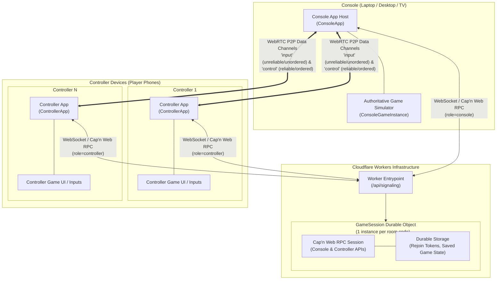

# Durable Objects Webgame Starter

> [!NOTE]
> Author's (read: prompter's) note: I built this using Claude and Jules, and I had Claude write this README. Calibrate your expectations accordingly. I don't normally use AI to write words for others to read; I used AI here because the primary audience is myself and my AI tools that will implement a game on top of this. But please feel free to open an issue if you run into problems with this project. 

A starter template for browser-based multiplayer party games in the "Jackbox" mold: one **console** (a laptop/desktop, shown on a shared screen) and any number of **controllers** (players' phones), connected over WebRTC with a Cloudflare Durable Object handling signaling. Built on top of [Astroflare](https://github.com/tylermercer/astro-cloudflare-starter), an opinionated Astro + Cloudflare Workers starter.

- Players open the console's URL on a laptop/desktop, which shows a QR code.
- Each player scans it with their phone to join as a controller — no app install, no manual pairing.
- Once connected, the console and each controller talk directly over WebRTC data channels; the Durable Object is only involved in the initial handshake.
- The console is the single authoritative game simulator; controllers just report player input and render local UI (buttons, joysticks).

For the full design — Durable Object structure, the signaling protocol, WebRTC negotiation, data channel layout — see [`design-docs/2026-08-24-001-core-architecture.md`](./design-docs/2026-08-24-001-core-architecture.md). This README covers how to actually build a game on top of what's here.

## System architecture



## Getting started

1.  **Use this repo as a template** by clicking "Use this template" at the top of the GitHub page.
2.  **Clone your new repository**:
    ```bash
    git clone https://github.com/your-username/your-new-repo.git
    cd your-new-repo
    ```
3.  **Run the initialization script** and follow the instructions:
    ```bash
    bun ./scripts/init.ts
    ```
    Handles installing dependencies (via `pnpm`), customizing your project name and theme, setting up GitHub Secrets for deployment to Cloudflare, and — as its last step — verifying the production deploy pipeline and printing the deployed URL.
4.  **Try the demo as-is** before changing anything: open the deployed URL from step 3 on your laptop, pick `touch-demo` from the switcher UI, and scan the QR code with your phone. You should see a live dot on the console tracking your finger on the phone. That confirms the console → DO → controller → WebRTC pipe works end-to-end before you touch any game logic.

## Trying the examples

The switcher is the default experience out of the box with no setup needed.
- `touch-demo`: Raw touch input tracking showing real-time dot visualization across WebRTC data channels.
- `liars-dice`: Full turn-based game demonstrating private player state, turn timers, reconnect handling, state persistence (`saveGameState`), and coalesced state broadcasts.
- `flappy-royale`: Real-time simulation with per-player elimination, seeded/replayable procedural generation, and 60Hz tick-vs-render separation.
- `grid-dungeon`: Tile-grid movement and collision, multi-target camera following, and NPC pathfinding via `TileGrid`/`Camera`/`EntityRegistry`.

## What's already here

| Piece | File(s) | What it does |
|---|---|---|
| Signaling Durable Object | `src/lib/GameSession.ts`, `src/lib/signaling-api.ts` | One DO instance per room code. Relays WebRTC offer/answer/ICE between a console and its controllers over a [capnweb](https://github.com/cloudflare/capnweb) RPC session — no hand-rolled message parsing. Persists rejoin tokens and player numbers across DO cold-starts. |
| Room codes & QR join | `src/utils/generateRoomCode.ts`, console-side QR rendering | Console mints a short code client-side; the QR links to `/?code=<CODE>&game=<GAME>` — no in-app scanning needed. |
| WebRTC data channels | `src/transport/peer-connection.ts` | Two channels per console↔controller pair: `input` (unreliable/unordered, for high-frequency input) and `control` (reliable/ordered, for state that must arrive). |
| Game source seam | `src/contract/gameSource.ts` | The single seam between example switcher mode (State 1) and your own game mode (State 2). |
| Examples & Switcher | `src/examples/`, `src/components/DemoSwitcher.astro` | Out-of-the-box examples registry and UI switcher for testing before building your own game. |
| Custom Game Logic location | `src/logic/` | The scaffolded directory (`console.ts` & `controller.ts`) where your own game's logic will live. |
| Console app | `src/host/console.ts` | Generic console bootstrap handling QR rendering, connection tracking, and fixed-tick animation loop through `gameSource.ts`. |
| Controller app | `src/host/controller.ts` | Generic controller bootstrap handling WebRTC connection setup through `gameSource.ts`. |

## Building your own game

Transitioning from the initial example switcher state (State 1) to building your own game (State 2) is simple.

Run the ejection script when you're ready to convert the project into a single game:

```bash
bun ./scripts/eject.ts
```

This automates removing example routes, replacing `src/pages/index.astro` with the single-game `GameShell`, updating `src/contract/gameSource.ts` to point to `src/logic/`, and verifying the build with `pnpm astro check` and `pnpm build`.

Under the hood, ejection performs the following steps:
1. Implement `src/logic/console.ts` and `src/logic/controller.ts` per the `createGame` contract, using the framework primitives (`InputStateSync`, `createFixedTickLoop`, `createRng`, `sendControlCoalesced`, `rejoinToken`, `saveGameState`, `TileGrid.findPath`, `simplifyPath`, `steerToward`).
2. Delete `src/pages/play/` and `src/examples/`.
3. Replace `src/pages/index.astro` with `<Layout><GameShell /></Layout>`.
4. Replace `src/contract/gameSource.ts` with the State 2 logic (`src/contract/gameSource.state2.ts`).

### Input: discrete events vs. continuous state

- **Discrete events** (taps, swipes, gestures) — use the existing `input` channel event pattern directly (`{type:'touch', phase, x, y}` or your own event shape).
- **Continuous input** (joystick position, held buttons) — use `InputStateSync` (`src/utils/InputStateSync.ts`), which sends a full state snapshot at a fixed rate rather than an event log. This matches the `input` channel's unreliable delivery: a dropped snapshot just means one stale frame, corrected by the next one.

### Haptic Feedback on Controllers

Controllers can include tactile vibration on touch interactions using [web-haptics](https://github.com/lochie/web-haptics):

```ts
import { WebHaptics } from "web-haptics";

const haptics = new WebHaptics();

// Trigger a short haptic vibration on initial pointer down / touch start only
function onPointerDown() {
  haptics.trigger("light");
}

// Clean up when destroying the controller instance
function destroy() {
  haptics.destroy();
}
```

### Simulation: fixed-tick loop

Game logic shouldn't run at display refresh rate. `createFixedTickLoop` (`src/utils/gameLoop.ts`) decouples a fixed-Hz simulation step from rendering:

```ts
createFixedTickLoop({
  tickRate: 30,
  onTick: (dt) => simulate(dt), // read latest input, advance world state
  onRender: (alpha) => draw(alpha), // interpolate for smooth rendering between ticks
});
```

This replaces the demo's `startAnimationLoop`, which just redraws every frame.

### Player identity across reconnects

By default, a controller refresh looks like a brand-new player joining — fine for the stateless demo, not fine for a game with per-player HP/position/inventory. `join()` on the signaling API accepts an optional `rejoinToken` (generate one with `crypto.randomUUID()`, persist it in `sessionStorage`); the DO reuses the player's existing `id`/`name` if the token matches a recent session, and holds their slot open for a grace period after a disconnect instead of immediately dropping them. Use this for any game where a player's state needs to survive a dropped connection or locked phone (see `src/examples/liars-dice/` for a complete example).

### Connection fallback

WebRTC connections between a console and controller are established using public STUN candidate discovery (`stun:stun.l.google.com:19302`). If a direct peer-to-peer connection cannot be established or maintained (such as on restrictive NATs or firewalls), the template automatically falls back to Durable Object message relaying:

- **Triggers**: Fallback to DO-relay occurs on initial WebRTC negotiation timeout (~8 seconds) or post-connection degradation (`disconnected`/`failed` connection states past a ~4 second grace timer).
- **Zero Configuration**: Fallback reuses the existing signaling WebSocket / Cap'n Web RPC session connected to the `GameSession` Durable Object. No external TURN server or extra deployment configuration is needed.
- **Transparent to Game Logic**: Both `PeerConnection` (P2P) and `RelayConnection` (DO relay) implement the shared `GameTransport` interface. Console and controller logic in `src/logic/` do not need to branch on transport mode.
- **Channel Semantics**: Under DO relay, delivery becomes reliable and ordered for both `input` and `control` messages without requiring any game-logic changes.

### Sending frequently-changing state reliably

The `control` channel is reliable and ordered — good for state you can't afford to lose, bad for anything that changes faster than the channel drains (e.g. HP after every hit), since naive sends queue up into a stale backlog. Use `sendControlCoalesced(key, msg)` on `PeerConnection` for "latest value wins" state (as demonstrated in `src/examples/liars-dice/console.ts` for broadcasting game state); it keeps only the newest message per key until the channel is ready to send. Use the plain `sendControl` for one-shot events that must all arrive (item pickups, identity assignment, or private dice dispatches).

### Deterministic randomness

`createRng(seed)` (`src/utils/rng.ts`) is a seedable PRNG with the same `() => number` contract as `Math.random`. Use it anywhere your game needs reproducible randomness — procedural generation, shuffles, loot rolls — especially if that randomness needs to survive a console refresh from the same seed (used in `src/examples/liars-dice/console.ts` to reproduce dice rolls across console reloads).

### Pathfinding & entity movement: stepwise vs. smoothed steering

`TileGrid.findPath` (`src/utils/tileGrid.ts`) provides A* pathfinding over 2D grids (with optional diagonal movement). Games can walk entities along paths using either of two first-class movement modes demonstrated in `src/examples/grid-dungeon/room.ts`:

- **Stepwise waypoint movement (Option A)**: `stepNpcWander` walks a raw A* waypoint list tile-center to tile-center in 4 or 8 directions.
- **Smoothed freely-angled steering (Option B)**: `simplifyPath` (`src/utils/pathSmoothing.ts`) greedily drops unnecessary waypoints via supercover line-of-sight checks, while `steerToward` and `moveCircleAgainstGrid` (`src/utils/circleMovement.ts`) steer entities in continuous any-angle motion while sliding around grid obstacles.

### Persisting game state

The console browser tab is the sole authoritative game simulator for a room. Simulation state (world state, player scores, card hands) only needs to survive same-device browser refreshes and belongs in `localStorage` on the console rather than the Durable Object server.

Use `saveLocalGameState`, `loadLocalGameState`, and `clearLocalGameState` (`src/utils/localGameState.ts`) to persist console game states namespaced by room code (`game_state_${roomCode}`):

```ts
import { saveLocalGameState, loadLocalGameState, clearLocalGameState } from "@utils/localGameState";

// Load saved state on console init
const saved = loadLocalGameState<MyGameState>(ctx.roomCode);

// Save state on updates
saveLocalGameState(ctx.roomCode, currentState);

// Clear state when a game genuinely resets or ends
clearLocalGameState(ctx.roomCode);
```

> **Durable Object Storage Best Practices**:
> - **Cross-device data vs. local simulation state**: Durable Object storage (`GameSession`) is reserved for authoritative cross-device network state (rejoin tokens, room membership, player limits). Single-device simulation state belongs in `localStorage`.
> - **Batch session metadata writes**: When updating room metadata in Durable Objects, combine related keys into a single compound object key (`sessionMeta: { rejoinTokens, kickedTokens, nextPlayerNumber, gracePeriodMs }`) rather than issuing separate `storage.put()` calls.

### Pixi.js for WebGL Canvas Games

For continuous-simulation games with complex visual effects (such as `flappy-royale`), Pixi.js provides a WebGL-accelerated retained scene graph backend as an alternative to hand-rolled Canvas2D. Note on bundle size trade-off: in the multi-example starter, example games are dynamic imports so Pixi is only fetched if `flappy-royale` is loaded. If you adapt this pattern into a single-game project (State 2), Pixi will be part of your main bundle — a worthwhile trade-off for a real-time, effects-heavy game, but likely unnecessary for simpler games.

## Design docs

`design-docs/` contains the planning docs for this template's architecture, written with Claude and implemented with Jules. Start with [`2026-08-24-001-core-architecture.md`](./design-docs/2026-08-24-001-core-architecture.md) for the console/controller/signaling model, and [`2026-08-24-002-additional-primitives.md`](./design-docs/2026-08-24-002-additional-primitives.md) for the game-building primitives described above. Add new docs here for any future large feature before implementing it.

## Inherited from Astroflare

This template started from [Astroflare](https://github.com/tylermercer/astro-cloudflare-starter) and keeps a few of its features:

### Core folder aliases

Folders under `src` have import aliases — `@utils/foo.ts` instead of `../../../utils/foo.ts` — configured for `assets`, `content`, `components`, `layouts`, `pages`, and `utils`.

### Commit hash logging

`@layouts/Base.astro` logs the current build's commit hash on page load via `logCommitHash` (`src/utils/logCommitHash.ts`), populated by the deploy pipeline.

**To remove:** delete `src/utils/logCommitHash.ts`, remove the script tag from `src/layouts/Base.astro`, and delete `PUBLIC_COMMIT_HASH: ${{ ... }}` from `.github/workflows/main.yml`.

### Scheduled builds (disabled by default)

The deploy workflow supports a daily cron build (useful for things like scheduled blog posts) — currently commented out in `.github/workflows/main.yml` since it doesn't apply to this project. Uncomment the `schedule` trigger there if you ever need it.
